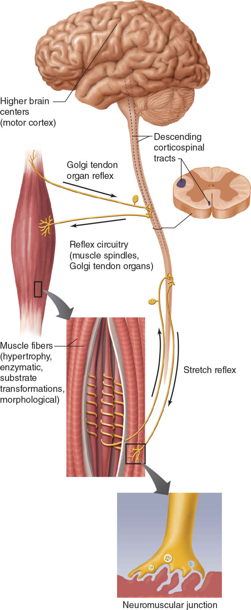

# 第5章：无氧训练的适应

Brandon Roberts, PhD, 和 Sean Collins, PhD

作者谨此感谢 Duncan French 和 Nicholas A. Ratamess 对本章所做出的重大贡献。

**完成本章学习后，你将能够：**

*   区分有氧训练适应与无氧训练后的解剖学、生理学及运动表现适应；
*   讨论无氧训练引起的中枢和外周神经适应；
*   了解如何通过操纵周期化训练计划中的急性训练变量来改变骨骼、肌肉结构、纤维类型和结缔组织；
*   解释无氧训练对内分泌系统的急性与慢性影响；
*   阐明无氧训练对心血管系统的慢性影响；
*   了解停训期间所产生的负面影响；以及
*   讨论无氧训练计划如何潜力提升肌肉力量、肌肉耐力、爆发力、灵活性（flexibility）与机动性（mobility）以及运动表现。

281

--- [Page 281 End] ---
无氧训练的特点是高强度、间歇性的运动，它要求三磷酸腺苷（ATP）的再生速度快于仅靠氧化代谢所能产生的速度。因此，能量需求依赖于更大比例的非氧化供能系统，其中包括磷酸原系统（或称磷酸肌酸系统）以及较小比例的糖酵解系统。因此，本书中使用“无氧训练”一词来描述主要依靠非氧化代谢来满足能量需求的强度下进行的运动训练。示例方式包括抗阻训练、增强式训练、速度灵敏训练和间歇训练。无氧训练产生的长期适应与训练计划的具体特征密切相关。例如，肌肉力量、爆发力、**肥大**、肌肉耐力、运动技能和协调性的提高，都被认为是无氧训练模式后的有益适应。最后，虽然在高质量的无氧活动中氧化代谢在 ATP 再生中的作用有限，但在低强度运动（恢复）或休息期间，它在能量储备的恢复中仍发挥着关键作用 (49)。

冲刺和增强式训练等练习主要对磷酸原系统施加压力；它们的持续时间通常小于 10 秒，并通过在组间允许几乎完全恢复（例如 5-7 分钟）来最大限度地减少疲劳。持续时间较长、高强度的间歇式训练主要利用糖酵解系统的能量产生，其中在高强度运动期间采用较短的休息间隔（例如 20-60 秒）。高强度运动与短休息时间的整合被认为是无氧训练的一个重要方面，因为运动员在比赛中经常需要在疲劳状态下执行接近最大强度的动作。然而，关键在于必须以能够优化决定运动表现的生理适应的方式来规划和处方适当的无氧训练。

282

--- [Page 282 End] ---
竞技体育需要所有能量系统的复杂相互作用，并展示了每个系统在多大程度上贡献于满足比赛的整体代谢需求（表 5.1）。

无氧训练后报告了广泛的身体和生理适应，这些变化使个人能够提高运动表现标准（表 5.2）。适应包括神经、肌肉、结缔组织、内分泌和心血管系统的变化。它们的范围从训练早期阶段（例如 1 到 4 周）发生的变化，到多年持续训练后发生的变化。大多数研究通常涉及训练早期到中期阶段（即 4-24 周）的适应。了解人体各个系统如何对使用无氧代谢的体育活动做出反应，为力量和体能专业人员提供了一个知识库，据此他们可以规划和预测特定训练计划的结果，从而有效地针对个人的优势和劣势进行干预。

表 5.1 各类运动的主要代谢需求

| 运动项目 | 磷酸原系统 | 糖酵解系统 | 有氧系统 |
| :--- | :--- | :--- | :--- |
| 美式橄榄球 | 高 | 中 | 低 |
| 射箭 | 高 | 低 | — |
| 棒球 | 高 | 低 | — |
| 篮球 | 高 | 中到高 | 低 |
| 拳击 | 高 | 高 | 中 |
| 板球 | 高 | 低 | — |
| 跳水 | 高 | 低 | — |

注：所有类型的代谢在某种程度上都参与了所有活动。

283

--- [Page 283 End] ---
| 运动项目 | 磷酸原系统 | 糖酵解系统 | 有氧系统 |
| :--- | :--- | :--- | :--- |
| 击剑 | 高 | 中 | — |
| 田赛（田径） | 高 | — | — |
| 曲棍球 | 高 | 中 | 中 |
| 高尔夫球 | 高 | — | 中 |
| 体操 | 高 | 中 | — |
| 冰球 | 高 | 中 | 中 |
| 长曲棍球 | 高 | 中 | 中 |
| 马拉松跑 | 低 | 低 | 高 |
| 综合格斗 | 高 | 高 | 中 |
| 篮网球 | 中 | 中 | 高 |
| 力量举 | 高 | 低 | — |
| 赛艇 | 低 | 中 | 高 |
| 橄榄球 | 高 | 高 | 中 |
| 滑雪： | | | |
| 越野滑雪 | 低 | 低 | 高 |
| 高山滑雪 | 高 | 高 | 中 |
| 足球 | 高 | 中 | 中 |
| 大力士运动 | 高 | 中到高 | 低 |
| 游泳： | | | |
| 短距离 | 高 | 中 | — |
| 长距离 | 低 | 中 | 高 |
| 网球 | 高 | 中 | 低 |
| 径赛（田径）： | | | |
| 冲刺跑 | 高 | 中 | — |
| 中距离跑 | 高 | 高 | 中 |

注：所有类型的代谢在某种程度上都参与了所有活动。

284

--- [Page 284 End] ---
| 运动项目 | 磷酸原系统 | 糖酵解系统 | 有氧系统 |
| :--- | :--- | :--- | :--- |
| 长距离跑 | — | 中 | 高 |
| 超长距离耐力 | — | — | 高 |
| 排球 | 高 | 中 | — |
| 水球 | 高 | 高 | 高 |
| 举重 | 高 | 高 | 中 |
| 摔跤 | 高 | 中 | 低 |

注：所有类型的代谢在某种程度上都参与了所有活动。

表 5.2 抗阻训练的生理适应

| 变量 | 抗阻训练适应 |
| :--- | :--- |
| **运动表现** | |
| 肌肉力量 | 增加 |
| 肌肉耐力 | 高功率输出下的耐力增加 |
| 有氧功率 | 无变化或略有增加 |
| 无氧功率 | 增加 |
| 力量产生速率 (RFD) | 增加 |
| 垂直跳 | 改善能力 |
| 冲刺速度 | 改善 |
| **肌纤维** | |
| 肌纤维横截面积 | 增加 |
| 毛细血管密度 | 无变化或减少 |
| 线粒体密度 | 减少 |
| 肌原纤维密度 | 无变化 |
| 肌原纤维体积 | 增加 |
| 细胞质密度 | 增加 |

ATP = 三磷酸腺苷；ATPase = 三磷酸腺苷酶。

285

--- [Page 285 End] ---
| 变量 | 抗阻训练适应 |
| :--- | :--- |
| 肌球蛋白重链蛋白 | 增加 |
| 核糖体能力 | 无变化或增加 |
| 核糖体效率 | 无变化或增加 |
| 肌细胞核磁畴 (Myonuclear domain) | 增加 |
| **酶活性** | |
| 肌酸磷酸激酶 | 增加 |
| 肌激酶 | 增加 |
| 磷酸果糖激酶 | 增加 |
| 乳酸脱氢酶 | 无变化或可变 |
| 钠-钾 ATP 酶 | 增加 |
| **代谢能量储备** | |
| 储存的 ATP | 增加 |
| 储存的磷酸肌酸 | 增加 |
| 储存的糖原 | 增加 |
| 储存的甘油三酯 | 可能增加 |
| **结缔组织** | |
| 韧带强度 | 可能增加 |
| 肌腱强度 | 可能增加 |
| 胶原蛋白含量 | 可能增加 |
| 骨密度 | 无变化或增加 |
| **身体成分** | |
| 体脂百分比 | 减少 |
| 去脂体重 | 增加 |

ATP = 三磷酸腺苷；ATPase = 三磷酸腺苷酶。

286

--- [Page 286 End] ---
## 神经适应

许多无氧训练模式强调肌肉速度和爆发力的表达，并极大地依赖于最佳的神经征召以实现最大表现（以及高质量的训练）。无氧训练有可能在整个神经肌肉系统中引发长期适应，从高级脑中枢开始，一直持续到单个肌纤维水平（图 5.1）。神经适应对于优化运动表现至关重要，而增加的神经驱动对于最大化肌肉力量和爆发力的表达至关重要。增强的神经驱动被认为会导致主动肌（即参与特定动作或练习的主要肌肉）的**运动单位**征召增加，并可能增加神经元的**放电率** (3, 65, 140, 149)。此外，抑制机制（即来自高尔基腱器官）的减少和拮抗肌共同激活的减少也被认为会随着长期训练而发生 (3, 149)。虽然这些复杂反应如何共存尚未完全明确，但显而易见的是，神经适应通常发生在骨骼肌出现任何结构变化之前 (167)。

287

--- [Page 287 End] ---
288

--- [Page 288 End] ---
图 5.1 神经肌肉系统内潜在的适应部位。

### 中枢适应

**运动单位**激活的增加始于高级脑中枢，在那里产生最大水平肌肉力量和爆发力的意图会导致运动皮层活动增加 (45)。随着产生的力量水平上升，或者当学习新的练习或动作时，初级运动皮层的活动会升高，以支持对神经肌肉功能增强的需求。无氧训练方法的适应随后反映在脊髓中实质性的神经变化，特别是沿着下行皮层脊髓束 (4)。事实上，在使用无氧训练计划后，主动肌的意志激活和高阈值**运动单位**的征召已被证明会有所提高，这与骨骼肌力量产生的改善相关 (130)。这与在未经训练的个体中看到的情况相比 (3)，后者的最大征召**运动单位**的能力有限。在伤后康复者中，电刺激已被证明比意志收缩在诱发力量增长方面更有效 (41)。其他研究表明，在未经训练的人群进行最大努力时，只有 71% 的肌肉组织被激活 (7)。

### 运动单位的适应

神经肌肉系统的功能单位是**运动单位**。**运动单位**由 α-运动神经元及其激活的肌纤维组成，对于细小、复杂的肌肉，一个**运动单位**可能支配少于 10 根肌纤维；而对于巨大的、强有力的躯干和肢体肌肉，则可能支配超过 100 根肌纤维。为了最大化肌肉力量的表达，必须大幅增加对**运动单位**池的突触输入，以引起所有可用**运动单位**的征召，并将这些**运动单位**的放电频率提高到其最佳频率。这种**运动单位**征召与放电频率调制的关联，使得精细分级肌肉力量产生的能力成为可能。

289

--- [Page 289 End] ---
因此，**运动单位**的**放电率**（或发放率）的变化也会影响肌肉力量的产生。随着**运动单位****放电率**的增加，肌纤维在先前动作电位后的完全放松之前，会不断被随后的动作电位激活。因此，增加**运动单位****放电率**增强了连续肌肉抽搐的叠加，这表现为收缩强度的增强 (1)。**运动单位****放电率**的增加代表了一种潜在的适应机制，它与抗阻训练引起的力量增长相关 (166)。主动肌最大力量和爆发力的获得通常与征召增加、**放电率**增加、肌内神经放电的**运动单位**同步化程度更高、以及肌间协调性改善有关；肌间协调性是协调运动中多个协同肌肉活动的习得性运动行为 (40a, 148)；或者是所有这些因素的结合。

**运动单位**按顺序进行的征召或解离受**亨内曼尺寸原则**（Henneman’s size principle，图 5.2）支配，该原则代表了**运动单位**抽搐力量与征召阈值之间的关系 (140)。根据这一原则，**运动单位**根据其胞体大小按升序征召。因此，具有小运动神经元的**运动单位**比具有大运动神经元的**运动单位**具有更低的征召阈值。高阈值**运动单位**通常容易疲劳，但具有更大的产力能力。**运动单位**的征召阈值也决定了其**放电率**特征，因此**运动单位**征召阈值与其典型**放电率**之间存在负相关。这种安排提供了几个优势，包括精确分级力量产生的能力——特别是在低水平力量产生时——以及增强的抗疲劳能力 (29a, 38a)。

290

--- [Page 290 End] ---
