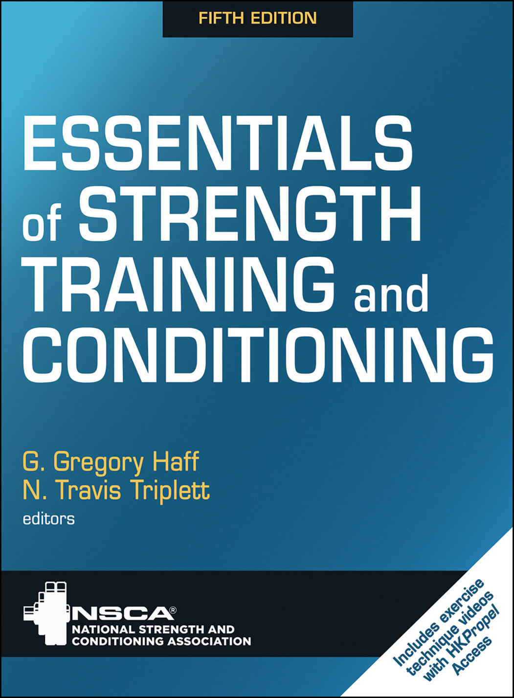

1

--- [Page 1 End] ---

2

--- [Page 2 End] ---

了解 HKPropel！

在《抗阻训练与体能训练精华（第五版）》的本版本中，您会发现多处提到了 HKPropel 在线内容。HKPropel 包含一系列 25 项抗阻训练练习的视频剪辑，旨在帮助您理解并执行正确的练习技术。此外，还提供了实验活动，让学生能够亲身体验测试与评估。这 20 份表格使完成和提交实验作业变得简单。购买此电子书时，可能已包含 HKPropel 的访问代码。
要使用购买电子书时收到的代码通过 HKPropel 访问在线资料，请按照以下步骤操作。

注意：如果您是教员，请使用 Human Kinetics 销售代表提供的 HKPropel 访问代码，而不是随电子书购买收到的代码，并忽略此处列出的其余步骤。

如果您是第一次使用 HKPropel：

1. 访问 HKPropel.HumanKinetics.com。

2. 点击开启屏幕上的“新用户？在此注册”链接，注册账户并兑换您的一次性访问代码。

3. 按照屏幕提示创建您的 HKPropel 账户。使用有效的电子邮件地址作为用户名，以确保您收到重要的系统更新，并在您需要帮助时帮助我们找到您的账户。

4. 准确输入提供给您的访问代码，包括连字符。在后续访问中您不需要重新输入此代码，且此访问代码不能被任何其他用户兑换。

3

--- [Page 3 End] ---

5. 在第一次访问后，只需登录 HKPropel.HumanKinetics.com 即可访问您的数字产品。

如果您已经拥有 HKPropel 账户：

1. 访问 HKPropel.HumanKinetics.com 并使用您的用户名（电子邮件地址）和密码登录。

2. 登录后，点击右上角姓名旁边的箭头，然后点击“我的账户”。

3. 在“添加访问代码”标题下，准确输入提供给您的访问代码（包括连字符），然后点击“添加”按钮。

4. 代码兑换后，导航至仪表板上的“图书馆”以访问您的数字内容。

如果您随此电子书未收到访问代码，请按照以下步骤购买 HKPropel 访问代码：

1. 访问 https://us.humankinetics.com/products/
essentials-of-strengthtraining-and-conditioning-5th-
edition-hkpropel-access

2. 点击“加入购物车”按钮并完成购买过程。

3. 成功完成购买后，您将收到一封电子邮件，其中包含在 HKPropel 上访问数字产品的说明。

给学生的提示：如果您的教员使用 HKPropel 为您的班级布置作业，您需要在 HKPropel 的“我的账户”页面输入班级注册令牌。此令牌将由您的教员免费提供，但它是除提供的唯一访问代码之外必须填写的。

4

--- [Page 4 End] ---

如果您需要帮助，请通过电子邮件联系我们：HKPropelCustSer@hkusa.com。

5

--- [Page 5 End] ---

6

--- [Page 6 End] ---

抗阻训练与
体能训练精华

第五版

G. Gregory Haff, PhD, CSCS,*D, FNSCA

N. Travis Triplett, PhD, CSCS,*D, FNSCA

主编

7

--- [Page 7 End] ---

美国国会图书馆在版编目数据

姓名：Haff, G. Gregory, 1969- 编辑 | Triplett, N. Travis, 1964- 编辑 | 美国国家力量与体能协会 (U.S.)
书名：抗阻训练与体能训练精华 / 美国国家力量与体能协会，G. Gregory Haff, PhD, CSCS,*D, FNSCA，埃迪斯科文大学，澳大利亚君达乐；N. Travis Triplett, PhD, CSCS,*D, FNSCA，阿巴拉契亚州立大学，北卡罗来纳州布恩，主编。
描述：第五版。| 伊利诺伊州香槟市：Human Kinetics, [2027] | 包含参考书目和索引。
标识符：LCCN 2025043720 (印刷版) | LCCN 2025043721 (电子书) | ISBN 9781718216273 硬壳本 | ISBN 9781718216280 epub | ISBN 9781718216297 pdf
主题：LCSH: 体育教育与训练 | 肌肉力量 | 身体素质——生理学方面 | BISAC: 健康与健身 / 运动 / 抗阻训练 | 健康与健身 / 参考
分类：LCC GV711.5 .E88 2027 (印刷版) | LCC GV711.5 (电子书)
LC 记录查询地址：https://lccn.loc.gov/2025043720
LC 电子书记录查询地址：https://lccn.loc.gov/2025043721

ISBN: 978-1-7182-1627-3 (印刷版)

版权所有 © 2027, 2016, 2008, 2000, 1994，由美国国家力量与体能协会所有。

Human Kinetics 支持版权。版权为科学和艺术事业提供动力，鼓励作者创作新作品，并促进言论自由。感谢您购买本作品的正版版本，并遵守版权法，未经出版商书面许可，不以任何形式复制、扫描或分发其任何部分。您正在支持作者，并让 Human Kinetics 能够继续出版增加知识、提升表现并改善世界各地人们生活的作品。

尽管有上述通知，但仍允许购买本作品的个人和机构复制以下材料：第 814-817, 823 页。

随附本产品的在线学习内容在 HKPropel (HKPropel.HumanKinetics.com) 上提供。如果您不接受该网站的隐私政策和条款与条件（其中详述了在线内容的获批用途），则表示您同意不使用 HKPropel。

要报告涉嫌侵犯 Human Kinetics 出版内容版权的行为，请通过 permissions@hkusa.com 与我们联系。要申请合法重复使用 Human Kinetics 出版内容的许可，请参考 https://US.HumanKinetics.com/pages/permissions-translations-faqs 上的信息。

除非另有说明，本正文中引用的网址截至 2025 年 5 月为最新。

高级策划编辑：Roger Earle；高级开发编辑：Laura Pulliam；执行编辑：Kevin Matz；文字编辑：Marissa Wold Uhrina；校对：Leigh

8

--- [Page 8 End] ---

Keylock；索引编制：Rebecca McCorkle/Prairie Indexing Services；许可经理：Laurel Mitchell；高级平面设计师：Julie L. Denzer；平面设计师：Denise Lowry；封面设计师：Keri Evans；封面设计专家：Susan Rothermel Allen；照片（内文）：© Human Kinetics，除非另有说明；照片资产经理：Laura Fitch；照片制作专家：Amy M. Rose；照片制作经理：Jason Allen；高级艺术经理：Kelly Hendren；插图：© Human Kinetics，除非另有说明；印刷：Walsworth

我们感谢位于科罗拉多州科罗拉多斯普林斯的美国国家力量与体能协会协助提供本书照片和视频拍摄场地。

Human Kinetics 的书籍可享受大批量购买的特殊折扣。也可以根据规格创建特别版或书籍节选。详情请联系 Human Kinetics 的特别销售经理。

美国印刷    10  9  8  7  6  5  4  3  2  1

本书所用纸张均采用负责任的林业方法制造。

Human Kinetics
1607 N. Market Street
Champaign, IL 61820
USA

美国及国际
网站：US.HumanKinetics.com
电子邮箱：info@hkusa.com
电话：1-800-747-4457

Human Kinetics 在欧盟的产品安全授权代表是 Mare Nostrum Group B.V., Mauritskade 21D, 1091 GC Amsterdam, The Netherlands.
电子邮箱：gpsr@mare-nostrum.co.uk

E8823

9

--- [Page 9 End] ---

10

--- [Page 10 End] ---

目录

前言
获取实验活动
致谢

第 1 章      身体系统的结构与功能

Michael D. Roberts, PhD

骨骼肌肉系统 • 神经肌肉系统 • 心血管系统 • 呼吸系统 • 对有氧运动的急性反应 • 对无氧运动的心血管和呼吸反应 • 结论

第 2 章      抗阻训练的生物力学

William R. Johnson, PhD, and Jason Lake,
PhD

骨骼肌群 • 解剖学平面和主要身体运动 • 人体力量与功率 • 肌肉收缩的阻力来源 • 关节生物力学：抗阻训练中的关注点 • 结论

第 3 章      运动与训练的生物能量学

Dale W. Chapman, PhD

11

--- [Page 11 End] ---

基本术语 • 生物能量系统 • 底物耗竭与补给 • 运动表现中的生物能量限制因素 • 摄氧量以及有氧和无氧对运动的贡献 • 训练的代谢特异性 • 结论

第 4 章      对抗阻运动和训练的内分泌反应

William J. Kraemer, PhD, Jakob L. Vingren,
PhD, and Disa L. Hatfield, PhD

对内分泌系统兴趣的历史回顾 • 内分泌术语、功能和机制 • 理解信号转导概念 • 内分泌系统在抗阻运动和训练中的功能 • 招募肌肉组织的重要性 • 肌肉作为激素相互作用的靶标 • 受体在调节激素变化中的作用 • 激素类别 • 胺类激素相互作用 • 训练介导的激素反应和机制 • 解释外周血中的激素变化 • 抗阻训练引起的内分泌系统适应 • 肌肉发育中的主要同化激素 • 生长激素 • 胰岛素样生长因子及其结合蛋白 • IGF 对运动的反应 • 训练适应与 IGF 及其结合蛋白 • 肾上腺、皮质醇及其在抗阻运动中的作用 • 儿茶酚胺及其在抗阻运动和训练中的作用 • 抗阻训练中的其他激素考虑因素 • 结论

第 5 章      对无氧训练的适应

Brandon Roberts, PhD, and Sean Collins,
PhD

神经适应 • 肌肉适应 • 结缔组织适应 • 对无氧训练的内分泌反应和适应 • 对无氧训练的心血管适应 • 有氧和无氧训练模式的兼容性 • 脱训 • 结论

12

--- [Page 12 End] ---

第 6 章      对有氧训练的适应

Kate Baldwin, PhD, and Glen B. Deakin,
PhD

对有氧运动的慢性适应 • 对有氧耐力训练的适应 • 影响有氧耐力训练适应的外部和个体因素 • 脱训 • 结论

第 7 章      年龄相关差异及其对抗阻训练的影响

Rhodri S. Lloyd, PhD, Sylvia Moeskops, PhD,
and Avery D. Faigenbaum, EdD

青少年群体 • 老年人 • 结论

第 8 章      性别相关差异及其对抗阻训练的影响

N. Travis Triplett, PhD, and Nicole Dabbs,
PhD

抗阻训练对女性的影响 • 训练反应与适应 • 抗阻训练考虑因素 • 结论

第 9 章      表现的心理学基础

13

--- [Page 13 End] ---

Daniel B. Hollander, EdD, and Adam Feit,
PhD

运动心理学的作用 • 理想表现状态 • 能量管理：唤醒、焦虑和压力 • 唤醒、焦虑和动机对表现影响的理论原则 • 动机 • 注意力与专注 • 提升表现的心理技术 • 心理健康与力量和体能训练 • 运动损伤的心理影响 • 增强运动技能的习得与学习 • 结论

第 10 章  影响健康的基本营养因素

Cassandra Forsythe, PhD, RD

运动营养专业人员的角色 • 标准营养指南 • 宏量营养素 • 维生素 • 矿物质 • 液体与电解质 • 结论

第 11 章  最大化表现的营养策略

Shawn M. Arent, PhD, and Abbie E. Smith-
Ryan, PhD

赛前、赛中和赛后营养 • 改变身体成分的营养策略 • 运动中的相对能量缺乏 (RED-S) • 摄食与饮食障碍 • 结论

第 12 章  提升表现的物质与方法

Bill I. Campbell, PhD, and Nathaniel D.M.
Jenkins, PhD

提升表现物质的类型 • 激素 • 膳食补充剂 • 结论

14

--- [Page 14 End] ---

第 13 章  测试选择与管理的原则

Claire Brady, PhD, and John McMahon, PhD

测试的原因 • 测试术语 • 测试质量评估 • 测试选择 • 测试管理 • 结论

第 14 章  选定测试的管理、评分与解释

David J. Heikkinen, PhD, Jo Clubb, MS, and
John McMahon, PhD

测量运动表现参数 • 监控方案、程序和设备 • 测试数据的统计评估 • 结论

第 15 章  表现准备、灵活性与柔韧性

Ian Jeffreys, PhD

表现准备——热身 • 柔韧性 • 拉伸类型 • 拉伸的计划考虑因素 • 结论

第 16 章  自由重量和器械训练的练习技术

Scott Caulfield, MA, Guy Hornsby, PhD, and
G. Gregory Haff, PhD

练习技术基础 • 自由重量练习的保护 • 结论

15

--- [Page 15 End] ---

第 17 章  替代模式和非传统器械训练的练习技术

Justin Keogh, PhD, and G. Gregory Haff,
PhD

一般指南 • 自重训练方法 • 核心稳定性与平衡训练方法 • 变阻训练方法 • 非传统器械训练方法 • 单侧训练 • 结论

第 18 章  抗阻训练的程序设计

Timothy J. Suchomel, PhD, and Paul
Comfort, PhD

无氧运动处方原则 • 第 1 步：需求分析 • 第 2 步：练习选择 • 第 3 步：训练频率 • 第 4 步：练习顺序 • 第 5 步：训练负荷与重复次数 • 第 6 步：量 • 第 7 步：间歇时间 • 结论

第 19 章  增强式训练的程序设计与技术

Chris A. Bailey, PhD, and Clive Brewer, MSc

增强式练习的力学与生理学 • 程序设计 • 程序长度 • 热身 • 年龄考虑因素 • 增强式练习与其他运动形式 • 安全考虑因素 • 结论

16

--- [Page 16 End] ---

第 20 章  速度与灵敏训练的程序设计与技术

Thomas Dos’Santos, PhD, and Paul A.
Jones, PhD

速度与灵敏力学 • 速度的神经生理学基础 • 跑动速度 • 发展速度的方法 • 灵敏表现与改变方向能力 • 发展灵敏的方法 • 程序设计 • 速度开发策略 • 灵敏开发策略 • 结论

第 21 章  有氧耐力与代谢训练的程序设计与技术

Glen B. Deakin, PhD, and Carwyn P.M.
Sharp, PhD

有氧耐力表现的相关因素 • 设计有氧耐力计划 • 有氧耐力训练计划的类型 • 程序设计在训练季节中的应用 • 与有氧耐力训练相关的特殊问题 • 结论

第 22 章  周期化

G. Gregory Haff, PhD

周期化的核心概念 • 周期化与训练过程规划 • 周期化模型 • 周期化层级 • 周期化阶段 • 将运动季节应用于周期化阶段 • 波动式与线性周期化模型 • 年度训练计划示例 • 结论

17

--- [Page 17 End] ---

第 23 章  康复、体能恢复与医学问题

Morey J. Kolber, PhD, PT, and William J.
Hanney, DPT, PhD

辅助医疗团队 • 损伤类型 • 组织愈合 • 康复与体能恢复的目标 • 程序设计 • 降低损伤与再次损伤风险 • 医学状况 • 结论

第 24 章  过度冲击、过度训练与恢复

Andrew C. Fry, PhD, and Bradley C. Nindl,
PhD

周期化与一般适应综合征 • 过度训练与过度冲击 • 过度训练连续体 • 导致过度冲击和过度训练的因素 • 表现不佳及其与过度训练和过度冲击的关系 • 受过度训练和过度冲击影响的表现相关变量 • 与过度冲击和过度训练相关的生理机制 • 过度冲击和过度训练的评估 • 恢复方法与策略 • 结论

第 25 章  场馆设计、布局与组织

Ryan Metzger, MS, Ryan Fowler, MS, and
Eric L. McMahon, MEd

新场馆设计的一般方面 • 现有的力量与体能训练场馆 • 卫星训练设施 • 户外训练空间 • 评估运动计划需求 • 设计力量与

18

--- [Page 18 End] ---

体能训练场馆 • 力量与体能训练场馆中的设备布置 • 维护和清洁表面及设备 • 结论

第 26 章  场馆政策、程序与法律问题

Brijesh Patel, MA, and Reed Wainwright, JD

使命陈述与程序目标 • 程序目的 • 力量与体能表现团队 • 法律与伦理问题 • 员工政策与活动 • 场馆行政管理 • 应急计划与响应 • 结论

学习题答案
索引
关于编者
撰稿人
历届版本撰稿人

19

--- [Page 19 End] ---

20

--- [Page 20 End] ---
